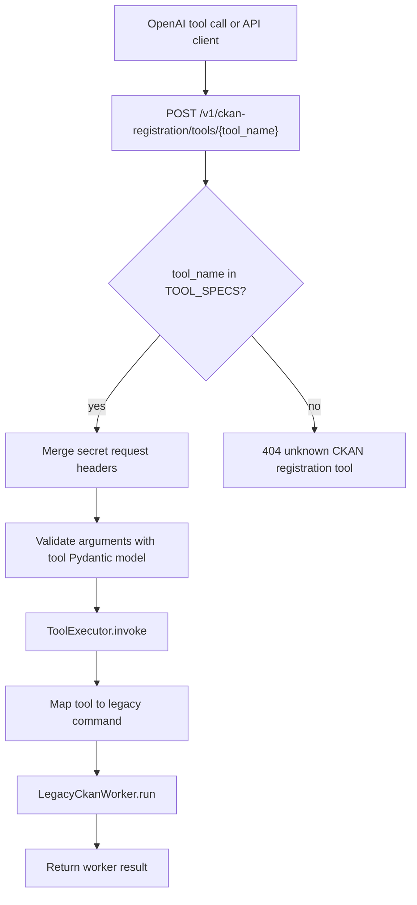
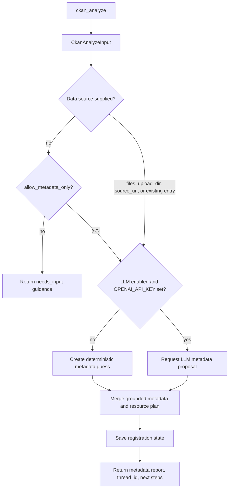
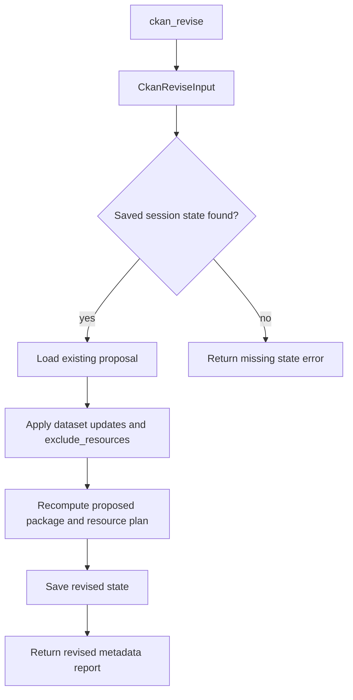
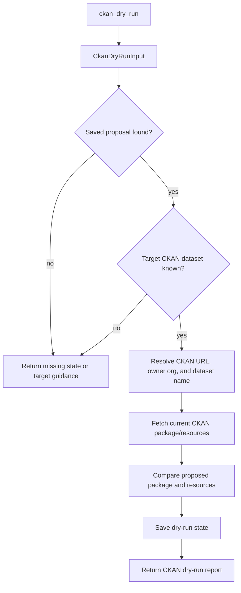
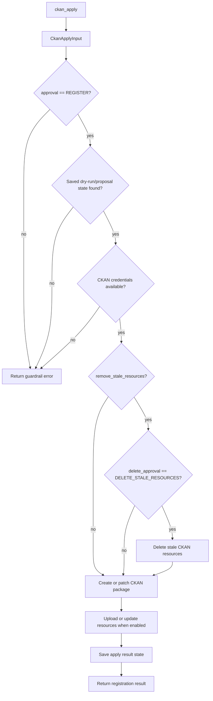
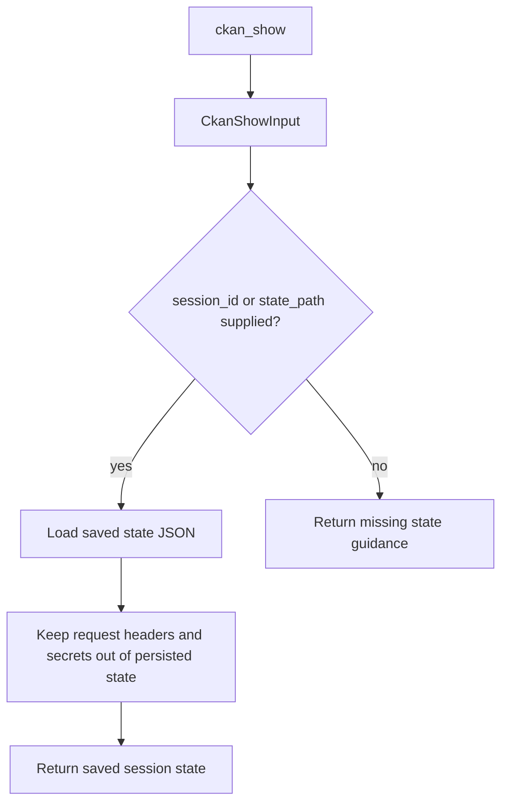

# CKAN Agent Tool Diagrams

These diagrams cover the tools registered in `app/agents/ckan_registration/tools.py`.
All tools are exposed through `POST /v1/ckan-registration/tools/{tool_name}` and
execute through `ToolExecutor` into the legacy CKAN registration worker.

## Shared Tool Invocation

## `ckan_analyze`

Builds proposed CKAN dataset metadata and a resource plan from staged files,
source URLs, or explicit dataset details. This is a safe-read tool.

## `ckan_revise`

Revises a saved CKAN registration proposal without writing to CKAN. This is a
safe-read tool.

## `ckan_dry_run`

Compares the saved CKAN registration proposal against the target CKAN dataset
without writing changes. This is a safe-read tool.

## `ckan_apply`

Creates or patches the CKAN dataset and optionally uploads resources. This is
the mutating tool.

## `ckan_show`

Returns saved CKAN registration session state for debugging or review. This is a
safe-read tool.

